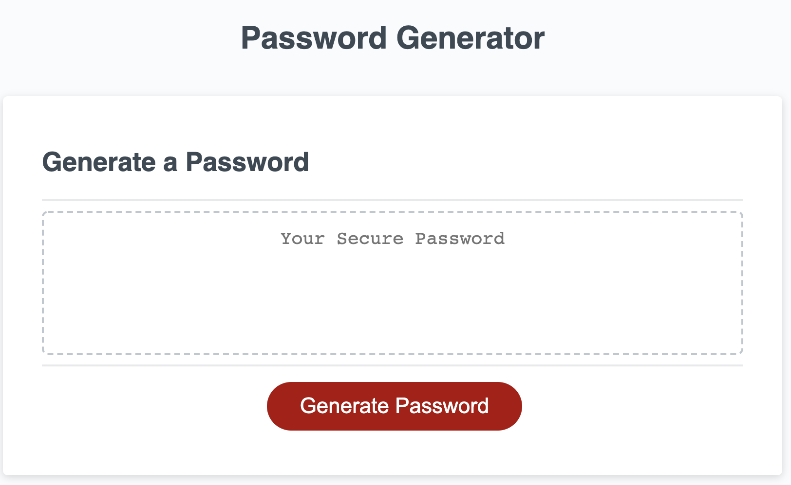
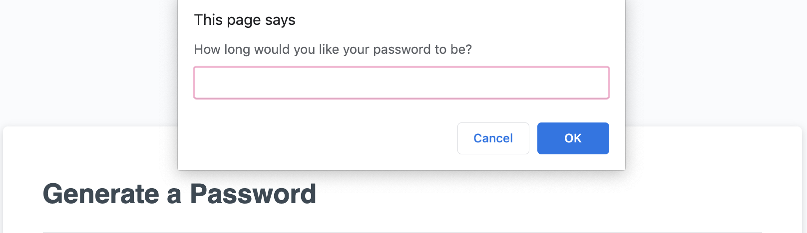
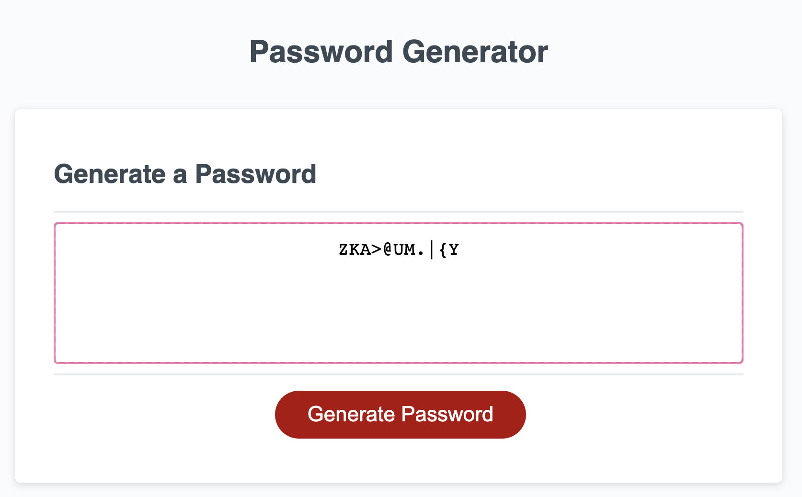

# password-generator

### Webpage Usage
This webpage is used to help users develop a secure password by randomly generating password using letters, numbers, and special characters. 

### The user is welcomed to the page with this screen:


### Prompts appear on screen to get the user's input about the password:



### Expected User Inputs:
- How long would you like your password to be?
- Should the password include lowercase characters?
- Should the password include uppercase characters?
- Should the password include numeric values?
- Should the password include special characters?


### Validation of Inputs:
 - User must choose a length of at least 8 characters and no more than 128 characters
 - User must select OK to include at least one character type


#### Possible Values for the Password :
Numbers = 0123456789
Lowercase Letters = abcdefghijklmnopqrstuvwxyz
Uppercase Letters = ABCDEFGHIJKLMNOPQRSTUVWXYZ
Special Characters = !"#$%&()*+,-./:;<=>?@[\]^_`{|}~


### When password generator is successful, the password will appear on screen in the box:



### Acceptance Criteria

```
GIVEN I need a new, secure password
WHEN I click the button to generate a password
THEN I am presented with a series of prompts for password criteria
WHEN prompted for password criteria
THEN I select which criteria to include in the password
WHEN prompted for the length of the password
THEN I choose a length of at least 8 characters and no more than 128 characters
WHEN prompted for character types to include in the password
THEN I choose lowercase, uppercase, numeric, and/or special characters
WHEN I answer each prompt
THEN my input should be validated and at least one character type should be selected
WHEN all prompts are answered
THEN a password is generated that matches the selected criteria
WHEN the password is generated
THEN the password is either displayed in an alert or written to the page
```
